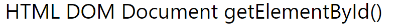
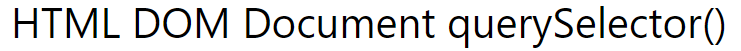
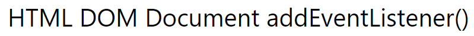
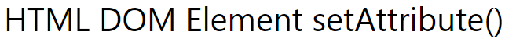

# Coding-Quiz-Challenge

Description of the project :

This project is about a coding quiz where in Javascript:

-  I declared some variables at the top using DOM Elements -  & 

- Using addEventListener method for event handler to a document. - 

- Created questions for the quiz.
- Declared related functions() & calling them later.
- If statement used for the timer function to run.
- setAttribute() method is used to hide the class - choices.

Links used :

https://www.w3schools.com/
https://www.w3schools.com/jsref/met_element_setattribute.asp
https://www.w3schools.com/jsref/met_element_removeattribute.asp
https://www.w3schools.com/jsref/met_element_queryselector.asp
https://www.w3schools.com/jsref/met_element_addeventlistener.asp
https://www.w3schools.com/jsref/met_document_getelementbyid.asp

Link to the deployed application :

Screenshot of the deployed application :

